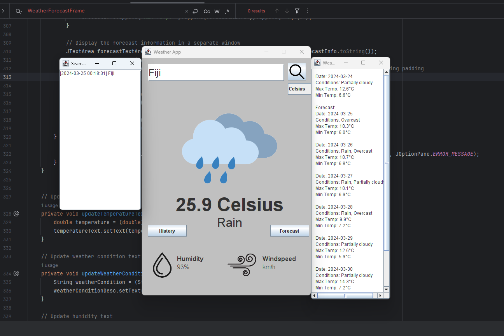

# Weather Information App

## Description

The Weather Information App is a Java application designed to provide users with real-time weather updates for specified locations. It utilizes a weather API to fetch relevant weather data and displays it in a user-friendly graphical user interface (GUI).

## Features

- Integration with a weather API (Open Meteo API) to fetch real-time weather data.
- User-friendly GUI design using Java Swing.
- Display of weather information including temperature, humidity, wind speed, and conditions for the specified location.
- Icon representation of weather conditions.
- Short-term weather forecast display.
- Option to switch between different units for temperature (Celsius, Fahrenheit) and wind speed.
- Proper error handling for scenarios like invalid location input or failed API requests.
- History tracking of recent weather searches with timestamps.
- Dynamic background changes based on the time of day.

## Installation

To run the Weather Information App, follow these steps:

1. Ensure you have Java installed on your system.
2. Download the source code files from [GitHub repository link].
3. Compile the Java files using a Java compiler.
4. Run the `AppLauncher` class to start the application.

## Usage

1. Upon launching the application, you will see the main GUI window.
2. Enter the location (city name or coordinates) for which you want to retrieve weather information in the provided input field.
3. Click on the "Search" button to fetch and display the weather data for the specified location.
4. You can switch between different units for temperature and wind speed using the dropdown menu provided.
5. Click on the "Forecast" button to view a short-term weather forecast for the chosen location.
6. The "History" button allows you to view a history of your recent weather searches along with timestamps.

## Screenshots

## Credits

- [Open Meteo API](https://open-meteo.com/)
- Icons sourced from [Iconfinder](https://www.iconfinder.com/)

## License

This project is licensed under the [MIT License](LICENSE).
